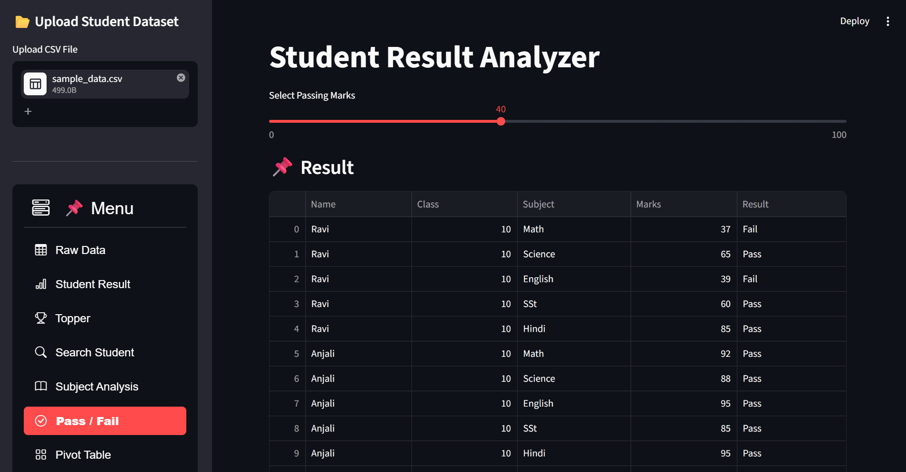

# Student Result Analyzer

A simple web-based student result analysis application built using Python and Streamlit. The application allows users to upload student datasets in CSV format and perform various analyses such as topper identification, subject-wise analysis, pass/fail evaluation, and student search.

## Features

* Upload and analyze CSV-based student datasets
* View raw student records
* Generate total and average marks for each student
* Display top-performing students
* Search for a student by name
* Subject-wise average marks analysis
* Pass/Fail classification based on custom passing marks
* Interactive pivot table for student vs subject marks
* Clean and responsive Streamlit interface

---

## Tech Stack

* Python
* Streamlit
* Pandas
* streamlit-option-menu

---

## Project Structure

```bash
student-result-analyzer/
│
├── app.py
├── requirements.txt
├── sample_data.csv
└── README.md
```

---

## Dataset Format

The uploaded CSV file should contain the following columns:

| Column Name | Description    |
| ----------- | -------------- |
| Name        | Student Name   |
| Subject     | Subject Name   |
| Marks       | Marks Obtained |

### Example

| Name  | Subject | Marks |
| ----- | ------- | ----- |
| John  | Math    | 85    |
| John  | Physics | 78    |
| Alice | Math    | 92    |

---

## Installation

### 1. Clone the Repository

```bash
git clone https://github.com/your-username/student-result-analyzer.git
```

### 2. Navigate to the Project Folder

```bash
cd student-result-analyzer
```

### 3. Create a Virtual Environment (Optional but Recommended)

#### Windows

```bash
python -m venv venv
venv\Scripts\activate
```

#### macOS/Linux

```bash
python3 -m venv venv
source venv/bin/activate
```

### 4. Install Dependencies

```bash
pip install -r requirements.txt
```

---

## Running the Application

Start the Streamlit app using:

```bash
streamlit run app.py
```

The application will open in your browser automatically.

---

## Sample Dataset

A sample dataset file named `sample_data.csv` is included in the project for testing the application.

You can upload this file directly after launching the app.

---

## Functionalities

### Raw Data

Displays the uploaded dataset in tabular format.

### Student Result

Calculates:

* Total marks of each student
* Average marks of each student

### Topper

Displays the top N students based on total marks.

### Search Student

Search and view individual student performance.

### Subject Analysis

Shows subject-wise average marks.

### Pass / Fail

Classifies students based on user-selected passing marks.

### Pivot Table

Creates a student vs subject marks table.

---

## Future Improvements

* Data visualization with charts
* Download analyzed reports
* Grade calculation system
* Authentication system
* Multi-file support
* Database integration

---

## Screenshots

### Home Page



---

## License

This project is open-source and available under the MIT License.
